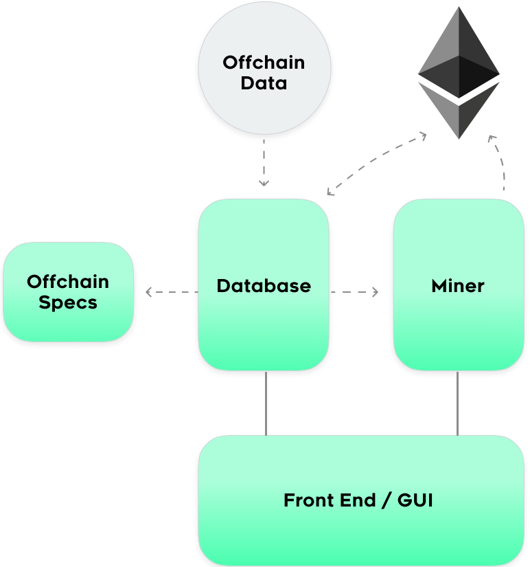

  

   

# Berry Miner

This is the workhorse of the Miner system as it takes on solving the PoW challenge.  
It's built on Go and utilizes a split structure.  The database piece is a LevelDB that keeps track of all variables (challenges, difficulty, values to submit, etc.) and the miner simply solves the PoW challenge.  This enables parties to split the pieces for optimization.

**The Berry system is a way to push data on-chain.  What the pieces of data are are specificied in the psr.json file. Note that the data corresponds to a specific API.  The berry mining system is set up to pull api data to generate these values to submit on-chain once a correct nonce is mined. These specific apis are just suggestions.  The system is not guarunteed to work for everyone.  It is up to the consnesus of the Berry token holders to determine what a correct value is. As an example, request ID 4 is BTC/USD.  If the api's all go down, it is the responsibility of the miner to still submit a valid BTC/USD price.  If they do not, they risk being disputed and slashed.  For these reasons, please contribute openly to the official Berry miner (or an open source variant), as consensus here is key.  If you're miner gets a different value than the majority of the of the other miners, you risk being punished.**

A list of all PSR's and the data expected can be found here: [https://docs.google.com/spreadsheets/d/1rRRklc4_LvzJFCHqIgiiNEc7eo_MUw3NRvYmh1HyV14](https://docs.google.com/spreadsheets/d/1rRRklc4_LvzJFCHqIgiiNEc7eo_MUw3NRvYmh1HyV14)

    

### Berry Deployed Addresses

Mainnet - [0x0ba45a8b5d5575935b8158a88c631e9f9c95a2e5](https://etherscan.io/address/0x0ba45a8b5d5575935b8158a88c631e9f9c95a2e5)

Rinkeby - [0xFe41Cb708CD98C5B20423433309E55b53F79134a](https://rinkeby.etherscan.io/address/0xFe41Cb708CD98C5B20423433309E55b53F79134a)

 

### Instructions for deployment

[Berry Miner Instructions](https://berry.readthedocs.io/en/latest/MinerSetup/)

[Berry Deployment Instructions -- From Source](https://berry.readthedocs.io/en/latest/MinerSetupFromSource/)

#### How to Contribute  
Join our Discord or Telegram:

### DISCLAIMER

    Mine at your own risk.  

    Mining requires you deposit 1000 Berry Tributes.  These are a security deposity.  If you are a malicious actor (aka submit a bad value), the community can vote to slash your 1000 tokens.  

    Mining also requires submitting on-chain transactions on Ethereum.  These transactions cost gas (ETH) and can sometimes be signifiant if the cost of gas on EThereum is high (i.e. the network is clogged).  Please reach out to the community to find the best tips for keeping gas costs under control or at least being aware of the costs. 

    If you are building a competing client, please contact us.  The miner specifications are off-chain and a the validity of the mining process hinges on the consensus of the Berry community to determine what proper values are.  Competing clients that change different pieces run the risk of being disputed by the commmunity.  

    There is no guaruntee of profit from mining. 

    There is no promise that Berry Tributes currently hold or will ever hold any value. 

Please join our Discord for more information and community updates. 

#### Contributors

This repository is maintained by the Berry team - [www.berrydata.co](https://www.berrydata.co)

#### Copyright

Berry Data 2021
